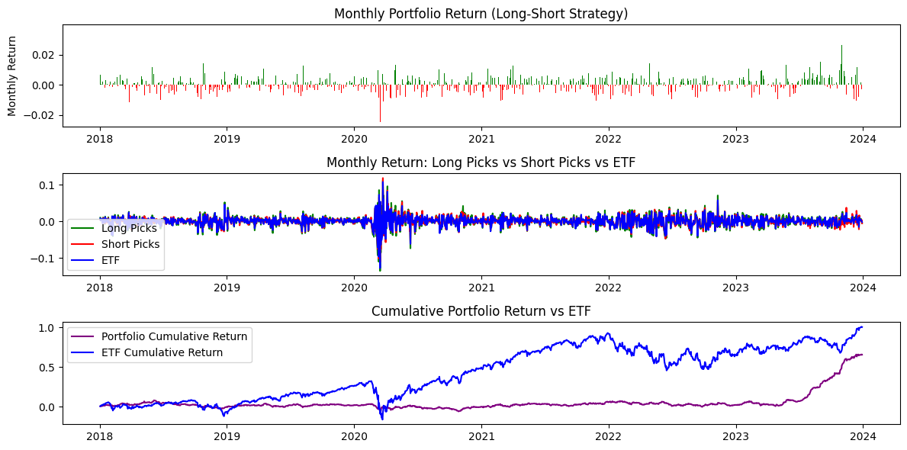

# Long-Short Equity Strategy Backtesting

## Overview
This project implements and evaluates a long-short investment strategy by simulating trades over historical market data.

## Objective
Assess the performance of a long-short portfolio and evaluate its effectiveness under different market conditions.

## Methods
- Constructed long and short positions based on defined signals
- Backtested the strategy over historical data
- Evaluated performance using cumulative returns and performance metrics

## Key Results
- Demonstrated how long-short strategies can hedge market exposure
- Evaluated portfolio performance over time

## Strategy Performance

Performance of the long-short strategy compared to the market benchmark.

## Tech Stack
Python, Pandas, NumPy

## Key Skills
Backtesting, financial modeling, time-series analysis

## File
- `long-short-equity-backtesting.ipynb`
